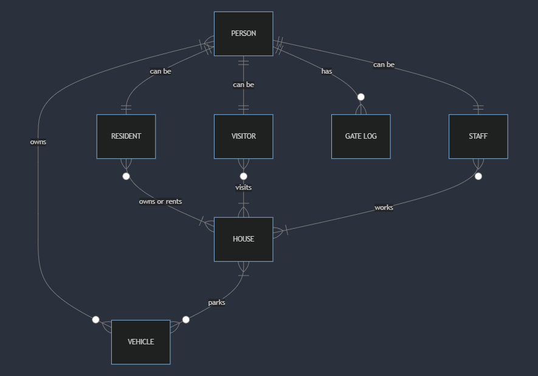

# Design Document

By Vaibhav Kumar

## Scope

The database for "Sunnyvale", a fictitious gated community, is designed to keep a record of all data possibly relevant to a gated community. The following are the entities that exist within the scope of this database:
* People - All human entities, and their basic identifying information
* Houses - Houses within the gated community, and their basic identifying information
* Vehicles - All vehicles associated with the gated community, and their basic identifying information
* Residents - A subset of the "people" table representing the residents of the gated community, connecting them to their respective houses, vehicles, and whether they are homeowners, tenants, or past residents
* Visitors -  A subset of the "people" table representing the visitors of the gated community, connecting them to their vehicles, which houses they have come to visit and the purpose of their visit
* Staff -  A subset of the "people" table representing the staff of the gated community, connecting them to their vehicles, which houses they are employed at, the nature of their work, and whether they stay with their employers, or whether they visit their employers on a daily basis
* Gate logs - A log of entry and exit timestamps of all people who enter/exit the gated community

Non-core attributes like pets, property sizes, make and model of vehicles, other unimportant identifying information of residents like their age, date of birth, their position in the community's housing association, etc. are out of the scope of this database.

## Functional Requirements

This database can be utilized to:
* Keep a track of what houses are occupied, and what houses are available for sale/lease
* Keep a track of the comings and goings of people in the community through the gate logs
* Add/update details of residents, visitors, staff members, vehicles, houses
* Look up staff members who perform certain roles, like a cook, if a resident requires a cook
* Keep a track of which vehicles belong to which resident, or which houses they are parked in
* Find houses of a particular configuration for sale/lease

At this stage, the database does not support deleting entities, which does make sense from a record-keeping perspective as it would be ideal to have a record of all the entities that have interacted with this gated community.

## Representation

### Entities

The database includes the following entities:

#### People

The `people` table includes:

* `id` - specifies the unique ID for the person as an `INTEGER`. This column has the `PRIMARY KEY` constraint applied.
* `first_name` - specifies the person's first name as `TEXT`, since `TEXT` is appropriate for name fields.
* `last_name` - specifies the person's last name as `TEXT`, since `TEXT` is appropriate for name fields.
* `contact_number` - specifies the person's contact number as `TEXT`, so that symbols, or leading/trailing "0" digits are not lost.
* `email` - specifies the person's email as `TEXT`, as `TEXT` is appropriate to capture email addresses which will most likely have a mix of symbols, alphabets, digits in them.

All columns in the `people` table are required. Therefore, each column has the `NOT NULL` constraint applied to it, unless the column already has a `PRIMARY KEY` or `FOREIGN KEY` constraint applied to it.

#### Houses

The `houses` table includes:

* `id` - specifies the unique ID for the house as an `INTEGER`. This column has the `PRIMARY KEY` constraint applied.
* `house_number` - specifies the house's number as `TEXT`. This is because the house number may have symbols, or alphabets in it. This column has the `UNIQUE` constraint applied to ensure no two houses have the same `house_number`.
* `house_name` - specifies the house's name as `TEXT`, since `TEXT` is appropriate for name fields. This column can be blank/`NULL`.
* `configuration` - specifies the house's configuration as `TEXT`, since the value for this is a mix of digits and alphabets. This column has a `CHECK` constraint applied to ensure the `configuration` value falls within an approved category of `'2BHK', '3BHK', or '4BHK'`.
* `occupancy_status` - specifies the house's availability as `TEXT`. This column has a `CHECK` constraint applied to ensure the `occupancy_status` value falls within an approved category of `'Available', or 'Occupied'`.

All columns in the `houses` table **(except for `house_name`)** are required. Therefore, each column has the `NOT NULL` constraint applied to it, unless the column already has a `PRIMARY KEY` or `FOREIGN KEY` constraint applied to it.

#### Vehicles

The `vehicles` table includes:

* `id` - specifies the unique ID for the vehicle as an `INTEGER`. This column has the `PRIMARY KEY` constraint applied.
* `number_plate` - specifies the number plate for the vehicle as `TEXT`. This column has the `DEFAULT` constraint applied if a person does not own a vehicle, to set the value to `'N/A'`.
* `people_id` - specifies the unique ID of the person who owns the vehicle as an `INTEGER`. This column has the `FOREIGN KEY` constraint applied, referencing the `id` column in the `people` table to ensure data integrity.
* `house_id` - specifies the unique ID of the house where the vehicle is parked as an `INTEGER`. This column has the `FOREIGN KEY` constraint applied, referencing the `id` column in the `houses` table to ensure data integrity.

#### Residents

The `residents` table includes:

* `id` - specifies the unique ID for the relationship of a resident with their house and their vehicle as an `INTEGER`. This column has the `PRIMARY KEY` constraint applied.
* `people_id` - specifies the unique ID of the resident as an `INTEGER`. This column has the `FOREIGN KEY` constraint applied, referencing the `id` column in the `people` table to ensure data integrity.
* `house_id` - specifies the unique ID of the resident's house as an `INTEGER`. This column has the `FOREIGN KEY` constraint applied, referencing the `id` column in the `houses` table to ensure data integrity.
* `vehicle_id` - specifies the unique ID of the resident's vehicle as an `INTEGER`. This column has the `FOREIGN KEY` constraint applied, referencing the `id` column in the `vehicles` table to ensure data integrity.
* `resident_status` - specifies if the resident is a homeowner, a tenant, or a past resident as `TEXT`. This column has a `CHECK` constraint applied to ensure the `resident_status` value falls within an approved category of `'Owner', 'Tenant', or 'Ex-Resident'`.

All columns in the `residents` table are required. Therefore, each column has the `NOT NULL` constraint applied to it, unless the column already has a `PRIMARY KEY` or `FOREIGN KEY` constraint applied to it.

#### Visitors

The `visitors` table includes:

* `id` - specifies the unique ID for the relationship of a visitor with the house they're visiting and their vehicle as an `INTEGER`. This column has the `PRIMARY KEY` constraint applied.
* `people_id` - specifies the unique ID of the visitor as an `INTEGER`. This column has the `FOREIGN KEY` constraint applied, referencing the `id` column in the `people` table to ensure data integrity.
* `house_id` - specifies the unique ID of the house the visitor is here to visit as an `INTEGER`. This column has the `FOREIGN KEY` constraint applied, referencing the `id` column in the `houses` table to ensure data integrity.
* `vehicle_id` - specifies the unique ID of the visitor's vehicle as an `INTEGER`. This column has the `FOREIGN KEY` constraint applied, referencing the `id` column in the `vehicles` table to ensure data integrity.
* `purpose_of_visit` - specifies the reason why the visitor is at the gated community as `TEXT`.

All columns in the `visitors` table are required. Therefore, each column has the `NOT NULL` constraint applied to it, unless the column already has a `PRIMARY KEY` or `FOREIGN KEY` constraint applied to it.

#### Staff

The `staff` table includes:

* `id` - specifies the unique ID for the relationship of a staff member with the house they're employed at and their vehicle as an `INTEGER`. This column has the `PRIMARY KEY` constraint applied.
* `people_id` - specifies the unique ID of the staff member as an `INTEGER`. This column has the `FOREIGN KEY` constraint applied, referencing the `id` column in the `people` table to ensure data integrity.
* `house_id` - specifies the unique ID of the house the staff member works at as an `INTEGER`. This column has the `FOREIGN KEY` constraint applied, referencing the `id` column in the `houses` table to ensure data integrity.
* `vehicle_id` - specifies the unique ID of the staff member's vehicle as an `INTEGER`. This column has the `FOREIGN KEY` constraint applied, referencing the `id` column in the `vehicles` table to ensure data integrity.
* `employment_role` - specifies the staff member's nature of employment as `TEXT`.
* `employment_type` - specifies the type of employment the staff member has taken on as `TEXT`. This column has a `CHECK` constraint applied to ensure the `employment_type` value falls within an approved category of `'Daily Visits', or 'Staying'`.

All columns in the `staff` table are required. Therefore, each column has the `NOT NULL` constraint applied to it, unless the column already has a `PRIMARY KEY` or `FOREIGN KEY` constraint applied to it.

#### Gate Logs

The `gate_logs` table includes:

* `id` - specifies the unique ID for the gate log as an `INTEGER`. This column has the `PRIMARY KEY` constraint applied.
* `people_id` - specifies the unique ID of the person as an `INTEGER`. This column has the `FOREIGN KEY` constraint applied, referencing the `id` column in the `people` table to ensure data integrity.
* `entry` - specifies the entry timestamp of the person as `NUMERIC`. This column has a `DEFAULT` constraint applied, where if there is no value entered into this column, the current timestamp will be automatically entered instead.
* `exit` - specifies the exit timestamp of the person as `NUMERIC`. This column has a `DEFAULT` constraint applied, where if there is no value entered into this column, the current timestamp will be automatically entered instead.

All columns in the `gate_logs` table are required. Therefore, each column has the `NOT NULL` constraint applied to it, unless the column already has a `PRIMARY KEY` or `FOREIGN KEY` constraint applied to it.

### Relationships

The below entity relationship diagram describes the relationships among the entities in the database.

As seen in the above entity relationship diagram:
* There is a 1-to-1 relationship between the concept of a person, and their classification as a resident, a visitor or a staff member.
* A person, no matter their classification, can own zero or many vehicles. However, if a vehicle exists, it must have atleast one owner.
* A vehicle can be associated with one or many houses. A house can have zero or many vehicles associated with it.
* A person, no matter their classification, can have zero or many gate logs. However, if a gate log row exists, it is associated with one person only.
* A resident can own/lease one or many houses, and a house can have zero or many residents.
* A visitor can visit one or many houses, and a house can have zero or many visitors.
* A staff member can be employed at one or may houses, and a house can have zero or many staff members.

## Optimizations

For optimizing the database to handle common queries, the following indexes were created:
* The `house_configuration_search` index was created on the `configuration` and `occupancy_status` columns of the `houses` table to allow for a faster look-up of what houses are available for sale/lease, and what the configuration of these available houses are.
* The `staff_role_search` index was created on the `people_id` and `employment_role` columns of the `staff` table to allow for a faster look-up of what staff members offer what services in the community, in a situation where a resident of the community is looking to employ a staff member with a certain skillset, like a cook, for example.

The database also includes the following views:
* `owners` - Easy access to all information (except IDs) relating to homeowners in the gated community.
* `tenants` - Easy access to all information (except IDs) relating to tenants in the gated community.
* `visitor_info` - Easy access to all information (except IDs) relating to visitors of the gated community.
* `staff_info` - Easy access to all information (except IDs) relating to staff members of the gated community.

## Limitations

The current design of this database lacks a proper method to represent security guards, since the `staff` table ties a staff member to a house, but security guards are more often than not for the entire gated community. It also lacks the ability to delete records easily, since all the tables are so heavily linked with foreign keys, though this might be a net positive because when it comes to record-keeping, it would be ideal to have all the records for reference. It also does not have a structure for a housing association, which is found in almost every community anywhere.
